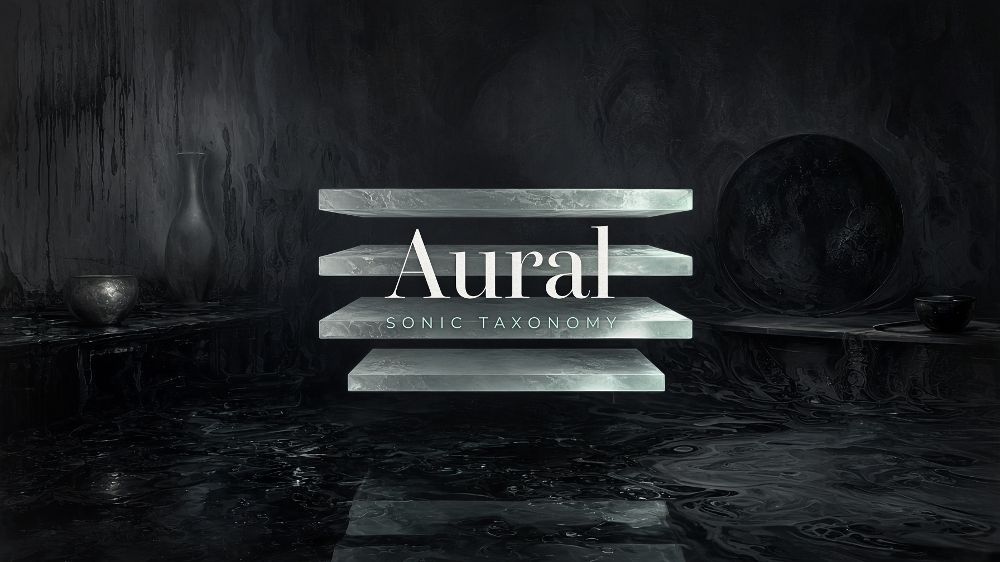
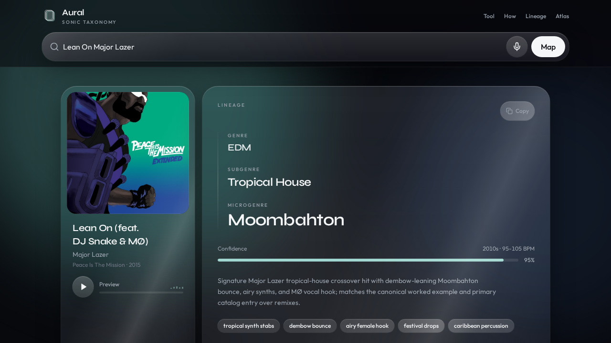

# Aural



I kept running into the same problem with music apps: they'd tag a song as "Dance" or "Electronic" and leave it there. That tells me nothing. I wanted to know where a track actually sits, from the big genre down to the subgenre and the tiny scene it came out of. So I built Aural.

You type a song, or just hold your phone up to whatever's playing, and it maps the track three levels deep: genre, subgenre, microgenre. Plus a few nearby scenes if you want to go digging.



## What's new in v2

**The mic works like Shazam now.** Tap it while a song is playing and Aural listens for up to 12 seconds (there's a little countdown ring and a live level meter so you know it's hearing something). It fingerprints the audio with [AudD](https://audd.io) to find the exact recording. If that doesn't find a match, it falls back to speech-to-text, so you can also just say or sing the title.

Getting this right took a while. Browsers run noise suppression, echo cancellation and auto gain on the mic by default, which is great for calls and terrible for music, because it filters the song out as "noise". I turned all of that off and grab the raw audio instead. I also had to wake up a suspended AudioContext on iOS, otherwise Safari just sat there recording silence.

**Genre detection got sharper.** When a fingerprint match comes back with Apple Music genre tags, I feed those into the classifier and into the catalog-only fallback, so all three levels come out more specific, even when no classifier key is set.

**Mobile got fixed.** A couple of grids were clipping on small screens, the header now gets a background once you scroll, and the album art shrinks to a thumbnail on phones so the lineage stays on screen.

## How to read a result

One rule I care about: the three levels have to be different. `Dance → Dance → Dance` isn't an answer, so Aural won't give you one.

If the classifier is set up, you get a full lineage with a confidence score. If it isn't, or it can't be reached, Aural falls back to catalog data and tells you the result is a rougher guess. And genre lines are fuzzy anyway, so treat the lineage as a way to explore, not a final ruling.

## Running it locally

```bash
npm install
npm run dev
```

Before pushing I run `npm run typecheck`, `npm test` and `npm run build`.

It's React + TypeScript on TanStack Start, with Tailwind and Zod. Song lookups come from iTunes Search and Deezer, recognition from AudD, and classification plus the speech fallback go through xAI. Everything runs server side so the keys never reach the browser.

| Variable | What it does |
| --- | --- |
| `AUDD_API_TOKEN` | Mic recognition. Without it AudD only gives you a handful of anonymous requests. |
| `XAI_API_KEY` | Genre / subgenre / microgenre classification and the speech fallback. |

The mic only works over HTTPS or on localhost.

## Where things live

- `src/lib/classify.ts` handles lookup, recognition, and all the fallbacks
- `src/lib/recognize.ts` parses fingerprint matches
- `src/lib/taxonomy.ts` has the "every level must be different" rules
- `src/components/` is the search and result UI
